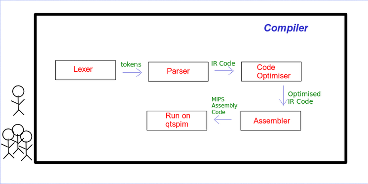

# UwU_Compiler
UwU compiler is based on UwU language, devloped in IITT

---

## INTRODUCTION
Our primary goal is to create a bespoke language based on the numerous programming constructs we've learnt from other programming languages. The language is known as 'Uwu.' To do this, we needed to create a lexer and parser that could parse the language according to the established grammar. All of the fundamental features, including as assignment, comparison, multiple expressions, looping, and conditional statements, are supported by our language. MIPS is the assembly code we want to use. The executable generated by makefile is used to carry out the entire compilation and parsing process. The following are the many steps of compilation that we have incorporated in our software.

|Stage|Details|
|-|-|
|Lexical Analysis |Tokenizes the contents of the input file (according to the language requirements).|
|Syntax Analysis|Makes a Parse Tree out of the tokens returned by the lexer. If an error occurs in either of the preceding two phases, the compiler does not proceed to semantic analysis.|
|Semantic Analysis|Creates an Abstract Syntax Tree and populates the Symbol Table for the appropriate Parse Tree. If an error is discovered during Semantic Analysis, the compiler does not generate proper code.|
|IR code generation|Construct IR code using the semantic tree's nodes storing in a synthesized attribute.|
|IR to MIPS Assembly|Convert into MIPS target assembly code and register allocation.|

## LANGUAGE AND TOOL CHOICES
Compiler for a new language named uwu is created using lex, yacc,cpp and shell. Code Generation is written in python and the output is assembly code according to the MIPS architecture. This is finally run using QTSpim. 

## MAJOR COMPONENTS OF PROJECT

### Pre-Processor
Pre process the uwu file, adding Headers (eg: `#add <./examples/pgm2.uwu>` ) and Macros (eg:`#define pp::print`) 

### Lexer
This is the lex program, which contains numerous regular expressions for all of the particular activities that a lexical analyzer must do. This file is transformed to lex.yy.c, which is then compiled to produce the executable a.out.
Parser including Grammar 
The parser has been built in the form of a yacc file called lexer.y, which implements the LALR(1) Parser and contains all of the grammar rules and actions for each production. Each production rule adheres to the S - ascribed Grammar idea (SAG). 

### Symbol Table
The Symbol Table includes entries for all parameters that have been declared or initialized.
It is implemented using a struct array, using the variable's index as input to the Data Structure.

### Intermediate Code Generation 
Using the semantic tree's nodes, we construct code and store it in a synthesized attribute.

### MIPS Assembly Code Generation 
Using the Custom IR code standard converting the code into MIPS assembly language and running on QtSPim for simulation.

## FLOW BETWEEN COMPONENTS (DIAGRAM)

## SOURCE CODE ORGANIZATION 
Source Files, header files 
We divided the project into modules, and each module represents a different stage of the compilation process. The working directory is made up of the following components:
Make File -On running it through the terminal a target parser is generated in the same working directory named ‘parser’
Examples The various test/sample cases using our designed grammar have been written in the files with ‘.uwu extension
Lexer.l  Lexical phase of the Compiler
Lexer.y  Parsing and Semantic analysis phase of the compiler 
run.sh    For preprocessor 

## Instruction
Run the makefile using make command in the terminal - 
On successful execution, an executable named ‘parser’ is created. - To run this use ./parser Examples/pgm1.uwu if you have to get the corresponding assembly output in MIPS for the pgm.uwu file. 
To run the parser on any other file, the format of the terminal command should be: - 
The assembly code will be written into the AssemblyCode.asm file of the Compiler folder. It can then be loaded into the QtSpim application from its file->Reinitialize and Load File
FINAL TESTING AND EVALUATION (WITH SCREENSHOTS) 

## LIMITATIONS OF THE COMPILER 
Our code does not contain the constructs for classes & struct.

## CONCLUSION
We were able to implement different components of compiler design and wrote lex and yacc files using the Bison package. We have tried to explore the actual phases of Compiler by implementing them practically. We have also modularized our project to the greatest extent feasible so that these Modules can operate independently of one another and can be improved in the future. The Code generation part has also been made isolated so that any target could be made from the generated Tree. We were able to take advantage of this feature and quickly switch our target assembly code from X86 to MIPS. Overall, the job was completed as a collaborative effort, and we utilized GitHub to share the source and manage task and role distributions.

## CONTRIBUTIONS
- Aditya - Language Specification Planning, Generating CFGs, Implementing Syntax analyzer, Writing report, MIPS Machine Code Generation, Testing our compiler with heavy codes, qtspim.
- Amit - Implementing Lexical analyzer, Testing Generating Syntax tree, Error detecting implementation, IR code Generation, Simulating MIPS on QtSpim.
- Vaibhav - Symbol Table, Parse Tree, Checking the generated tokens, Doing register allocation, Sample programs, User and developer manual.

